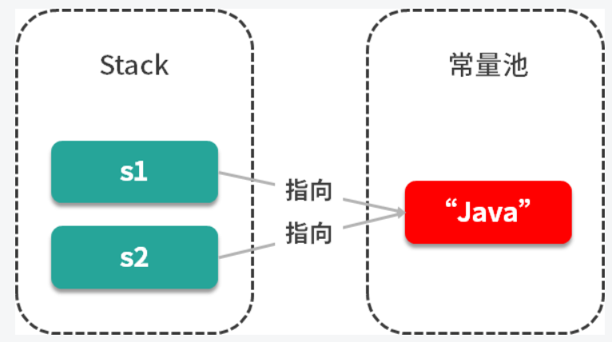

## 为什么 String 被设计为是不可变的

ps：只有字符串是不可变时，我们才能实现字符串常量池，字符串常量池可以为我们缓存字符串，提高运行效率，如上图所示

试想一下，如果 String 是可变的，那当 s1 的值修改之后，s2 的值也跟着改变了，这样就和我们预期的结果不相符了，因此也就没有办法实现字符串常量池的功能了

- 对于字符串为什么被设置为不可变，java 之父 James Gosling 的回答是，他更倾向于使用final，因为它能够缓存结果，当你在传参时不需要考虑谁会修改它的值；如果是可变类的话，则可能需要重新拷贝出来一个新值进行传参，这样在性能上就会有一定的损失
- James Gosling 还说迫使 String 类设计成不可变的另一个原因是安全，当你在调用其他方法时，比如调用一些系统级操作指令之前，可能会有一系列校验，如果是可变类的话，可能在你校验过后，它的内部的值又被改变了，这样有可能会引起严重的系统崩溃问题，这是迫使 String 类设计成不可变类的一个重要原因

总结来说，使用 final 修饰的第一个好处是**安全**；第二个好处是**高效**